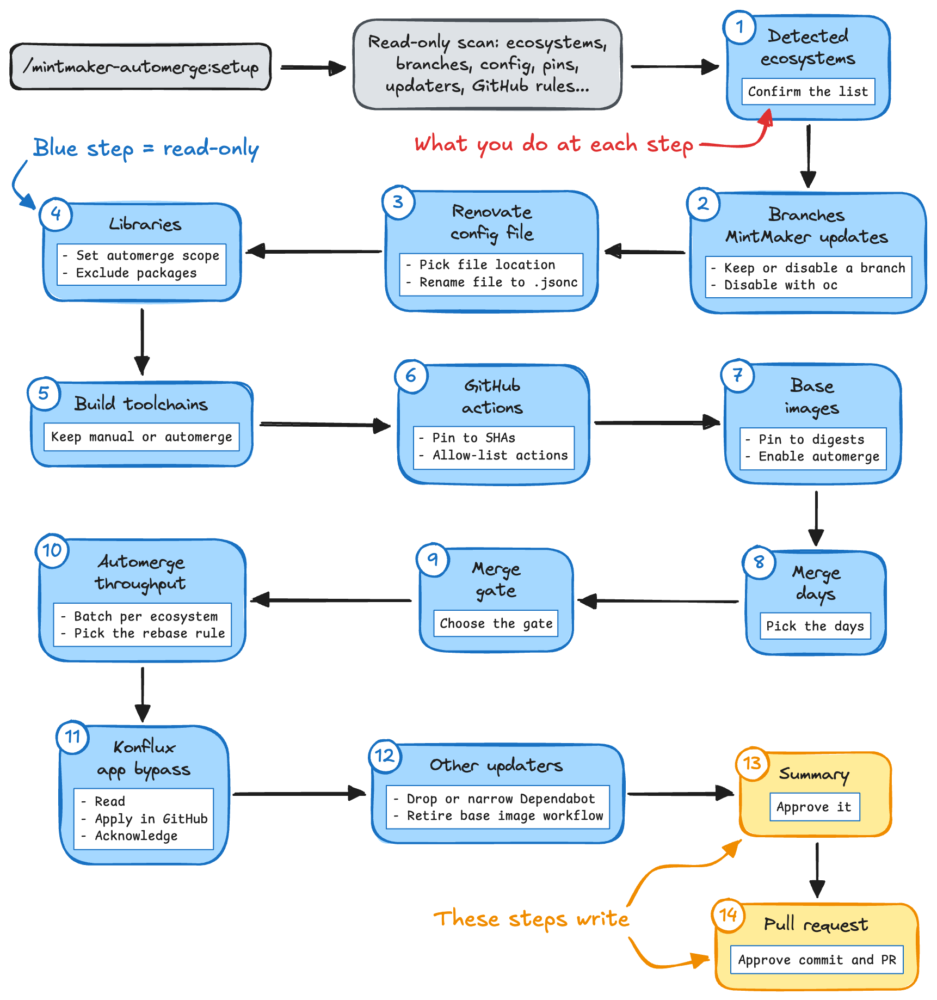

# MintMaker Automerge

[](https://github.com/gwenneg/mintmaker-automerge/releases/latest)
[](https://github.com/gwenneg/mintmaker-automerge/actions/workflows/ci.yml)
[](LICENSE)

**Let the routine MintMaker PRs of your Konflux repositories merge on their own.**

MintMaker Automerge is a [Claude Code](https://claude.com/claude-code)
plugin for repositories onboarded in [Konflux](https://konflux-ci.dev/),
where [MintMaker](https://github.com/konflux-ci/mintmaker) runs
[Renovate](https://github.com/renovatebot/renovate) and opens a pull
request for every dependency update. The plugin walks you through turning
on Renovate automerge for the updates a rule can judge, one decision at a
time, writes a commented `renovate.jsonc`, and explains the GitHub
settings automerge needs. A run takes about twenty minutes.

The blog post
[Let the routine MintMaker PRs merge themselves](https://gwenneg.com/2026/09/21/let-the-routine-mintmaker-prs-merge-themselves.html)
tells the story behind the plugin: what it does, why it is safe, and the
reasoning behind its main rules. This README is the reference for
installing and using it.

> [!IMPORTANT]
> This plugin only works on a GitHub repository onboarded in Konflux, the
> only place MintMaker runs. It refuses to run anywhere else.

## How it works



A read-only script scans the repository for its ecosystems, base images,
GitHub Actions, branches and existing Renovate config. Then fourteen short
steps ask a few questions each, with a recommended answer and a note on
what the choice changes in Renovate, GitHub or Konflux. Ask `why` during
the run to get a longer explanation.

- Nothing is written on disk before you approve the summary.
- Nothing is pushed before you approve the pull request.
- No GitHub setting is ever changed by the plugin. It explains the
  settings, checks them when the GitHub CLI is logged in, and you apply
  them yourself.

The updates you decide are low-risk merge on their own once the checks
pass, after MintMaker's release-age delay. Everything else stays on manual
review, exactly as today.

## Quick start

You need Claude Code and a GitHub repository onboarded in Konflux, one
with a `.tekton/` folder. A `gh` login is optional: with it, the run reads
the branch rules on GitHub and opens the pull request itself. Without it,
the run uses a GitHub token from your environment if there is one, and
otherwise gives you a link and the text to paste.

Install the plugin from a Claude Code session, from the
[claude-ichiba](https://github.com/gwenneg/claude-ichiba) marketplace:

```
/plugin marketplace add gwenneg/claude-ichiba
/plugin install mintmaker-automerge@claude-ichiba
/reload-plugins
```

Then, from the repository where you want to enable automerge:

```
/mintmaker-automerge:setup
```

At the end you have a reviewed config file on a branch, an open pull
request, and the list of GitHub settings to apply. Merging the pull
request turns automerge on.

> [!TIP]
> Claude Code only auto-updates plugins from its official marketplace.
> Enable auto-update for claude-ichiba in the `/plugin` panel, or refresh
> it yourself from time to time:
>
> ```
> /plugin marketplace update claude-ichiba
> /reload-plugins
> ```

## The fourteen steps

Every decision is a menu. All of them come with a recommended option,
except the branch question of Step 2, which is yours alone. A step that
does not apply to the repository is skipped with one line.

| Step | What you decide | Recommended answer |
|---|---|---|
| 1. Detected ecosystems | Whether the scan got the ecosystems right, and the default branch when the scan could not tell | Looks right |
| 2. Branches MintMaker updates | Whether MintMaker should stop opening PRs on one of the branches it runs on. On request, the how-to with `oc`, never applied by the plugin | Your call, asked only when several branches have a Konflux component |
| 3. Renovate config file | Where to create the file, or whether to rename a strict `.json` to `.jsonc` for the comments. An `extends` of MintMaker's global config and `baseBranchPatterns` are removed, since MintMaker applies both itself | `renovate.jsonc` at the root |
| 4. Libraries | How wide automerge goes for Maven, Gradle, Go, npm, Python, Cargo and Bundler, which packages never automerge, which packages may have their majors automerged, and whether indirect Go dependencies are included | Every patch and minor bump, the manual-review candidates found in the repo (Quarkus, Spring Boot, Django, Angular), no majors |
| 5. Build toolchains | Whether the Maven and Gradle wrappers, the Go `toolchain` line and npm's `packageManager` automerge | Keep manual: a bad one breaks every developer's local build |
| 6. GitHub Actions | Whether to pin actions to commit SHAs, which actions may automerge, and whether any of them may have its majors automerged | Pin, allow the actions maintained by GitHub, no majors |
| 7. Base images | Whether digest, patch and minor bumps of the `FROM` images automerge, and whether to pin them to digests | Yes to both |
| 8. Merge days | On which days PRs may open and merge, and whether Konflux pipeline updates follow those days or MintMaker's Saturday batch | Any day, pipeline updates on the same days |
| 9. Merge gate | Whether Renovate merges only when every check on the PR passes, or skips the checks and leaves the gate to the required checks of the base branch | Keep the checks |
| 10. Automerge throughput | How many PRs the automerged updates share, and whether an open PR is rebased whenever the base branch moves or only on conflict, after an explanation of why Renovate merges one PR per MintMaker run | One PR per ecosystem, rebase on every move |
| 11. Konflux app bypass | The one GitHub setting every setup needs when the branch requires an approval: where to add the Konflux app as a bypass actor, and what the repository has today when `gh` is logged in | Read it, apply it yourself. Skipped when already in place |
| 12. Other updaters | What happens to `dependabot.yml` and to a home-grown base-image workflow once Renovate covers the same ecosystem | Remove or narrow what overlaps |
| 13. Summary | One table with the whole trust decision, then whether to write the files to your working tree | Write the files, nothing committed yet |
| 14. Pull request | Whether to branch, commit, push and open the PR | Open the PR |

## What you get

A `renovate.jsonc` that reads like this, with your ecosystems and your
names in it:

```jsonc
// Set up with the MintMaker Automerge plugin v0.8.0: https://github.com/gwenneg/mintmaker-automerge
{
  "$schema": "https://docs.renovatebot.com/renovate-schema.json",
  // Renovate overrides for this repository. MintMaker merges them on top of its
  // global config, which sets the managers, the release-age delay, the
  // vulnerability alerts, branch naming and PR limits:
  // https://github.com/konflux-ci/mintmaker/blob/main/config/renovate/renovate.json
  // A key set here replaces the inherited value; packageRules are added to the
  // inherited ones; enabledManagers would replace the whole list, so it is never set.
  // Policy: patch and minor updates of the ecosystems below merge on their own once
  // the required checks pass. Majors stay on manual review unless a rule names them.
  // MintMaker docs: https://konflux-ci.dev/docs/mintmaker/user/
  // Renovate merges each PR itself, on the first run where GitHub allows the merge:
  // GitHub's auto-merge feature never completes when a bypass actor is what satisfies
  // the approval rule, so it stays off.
  "platformAutomerge": false,
  // Every check on the PR must be green first, required or not.
  "ignoreTests": false,
  "extends": [
    // Pins actions to commit SHAs, so a version bump can be told from a moved tag.
    "helpers:pinGitHubActionDigests"
  ],
  "tekton": {
    // Konflux pipeline updates in .tekton/: the PR's own Konflux build tests them.
    "automerge": true,
    // Any day, instead of MintMaker's Saturday batch.
    "schedule": ["at any time"]
  },
  "packageRules": [
    // --- github-actions: patch and minor of the actions named below, in one PR; majors, digest-only and every other action stay manual
    {
      // A floating tag such as v4 never changes, so its releases arrive as digest PRs that
      // never automerge. Pinning writes the full version once, in a manual PR, and later
      // releases are patch or minor.
      "matchManagers": ["github-actions"],
      "matchDepTypes": ["action"],
      "rangeStrategy": "pin"
    },
    {
      // Vetted by name: an action runs arbitrary code in CI. Patch and minor only, so a
      // moved tag with no version change, the shape of a hijacked action, never merges alone.
      "matchManagers": ["github-actions"],
      "matchUpdateTypes": ["patch", "minor"],
      "matchDepNames": ["actions/checkout", "actions/setup-java"],
      "automerge": true,
      "groupName": "GitHub Actions"
    },

    // --- maven: patch and minor, in one PR; majors, io.quarkus* and the wrapper stay manual
    {
      "matchManagers": ["maven"],
      "matchUpdateTypes": ["patch", "minor"],
      "automerge": true,
      "groupName": "Maven dependencies"
    },
    {
      // The wrapper is every developer's build tool, not just CI's.
      "matchManagers": ["maven-wrapper"],
      "automerge": false
    },
    {
      // Quarkus follows an LTS track, so a reviewer picks the target version. https://quarkus.io/releases/
      // Its own PR: a member that never automerges would hold the group.
      "matchManagers": ["maven"],
      "matchPackageNames": ["io.quarkus*"],
      "automerge": false,
      "groupName": null
    }
  ]
}
```

Alongside it, unless the repository already has one, a GitHub workflow
under `.github/workflows/` that runs MintMaker's own
[config validator](https://github.com/konflux-ci/renovate-config-validator-action)
whenever the config changes. The validator catches syntax and schema
errors but not a wrong name, so the plugin compares every name in the
rules with what the repository uses before the file is committed.

The pull request body records which GitHub settings you acknowledged
during the run, so a reviewer checks them before merging instead of
trusting the plugin.

What never automerges, whatever you answer: major version bumps except for
the packages you name, the packages on your manual-review list,
digest-only updates of GitHub Actions, Helm charts, Terraform, and any
ecosystem without a rule. The `renovate.jsonc` file itself is never
automerged either, so the bot can never loosen its own rules.

## How the safety adds up

Automerge is only as safe as the weakest of these layers, so the plugin
sets or explains every one of them.

| Layer | What it does | Who provides it |
|---|---|---|
| Release-age delay | No PR for a fresh release until MintMaker's delay has passed, for the window in which compromised releases are usually caught and pulled | MintMaker's global config, inherited |
| Update-type filter | `patch` and `minor` qualify by default, plus `digest` for base images. Majors stay manual unless you name the package | The generated rules |
| Allow-list for GitHub Actions | Each action is vetted by name, and only an action pinned to a SHA with a full version in its comment can automerge safely: a release then arrives as a patch or minor PR, and a moved tag as a digest PR that never automerges | The generated rules, plus SHA pinning |
| Manual-review list | Packages you name stay manual whatever the update type | Your answers |
| Renovate's own merge | GitHub's auto-merge feature is off, since it never completes behind a bypass actor. Renovate merges on a later MintMaker run, and only when every check on the PR is green, or the required checks alone when you chose `ignoreTests` | The generated config |
| Required status checks | Only when Renovate skips the checks: they are the whole gate then, and a check that is not required never holds a merge, red or not | You, in the branch ruleset |
| Scoped bypass | The Konflux app skips the approval rule only, in "For pull requests only" mode. It still has to pass the required checks | You, in the branch ruleset |

Two exceptions to know:

- Vulnerability fix PRs skip the release-age delay, so a patch or minor
  fix in an automerged ecosystem merges as soon as the checks pass. A fix
  that merged without the delay is worth a look afterwards.
- The delay only applies to releases that have a publish date, and
  Renovate only learns image publish dates from Docker Hub. A base image
  from `registry.access.redhat.com` or `quay.io`, and the Konflux task
  bundles, get no delay at all. For those images, the Konflux PR build is
  the only protection.

## Once it is live

- MintMaker runs every 4 hours, twice a day on busy Konflux clusters. A PR opens on one run, and Renovate merges
  it on a later one, the first where GitHub allows the merge: hours after
  the checks went green, not minutes.
- A fresh release shows up once the release-age delay has passed, with a
  passing `renovate/stability-days` check. Nothing lists the updates being
  held, since MintMaker disables Renovate's dependency dashboard.
- The PR body says `Automerge: Enabled` when the rules matched. When it
  is missing, the config did not match that update.
- The first PR from the Konflux app that merges with passing checks and no
  human approval confirms the bypass works.
- The new rules also apply to the PRs MintMaker already has open, so the
  first unattended merges will most likely be those.
- When you chose to pin actions, an action referenced by a floating tag
  such as `v4`, in the workflow or in the comment next to its SHA, gets
  one manual "Pin dependencies" PR that writes its full version. Merge
  it: until then, that action's releases arrive as digest PRs that never
  automerge.

## Troubleshooting

| Symptom | Cause | What to do |
|---|---|---|
| `Automerge: Enabled` is missing from a PR that should qualify | The rules did not match the update: wrong package or action name, or an update type outside `patch` and `minor` | Compare the name in the rule with the one in the PR title. The validator does not catch a name that matches nothing. |
| An allow-listed action only ever gets "Update ... digest" PRs | Its version comment is a floating tag such as `# v4`, so Renovate keeps it and every release is a digest update | Merge the "Pin dependencies" PR, which writes the full version. A config written by an earlier version of the plugin lacks the `rangeStrategy: pin` rule: rerun the setup, or copy the rule from the example above. |
| A qualifying PR sits open with green required checks | Renovate waits for every check on the PR, and a check that is not required, a vulnerability scan for instance, is red | Fix the finding, or rerun the setup and choose the required checks as the only gate, with care about which checks are required. |
| A qualifying PR sits open with all checks green | The merge happens on a later MintMaker run, up to 4 hours after the checks passed, up to 12 on a busy cluster, or a commit from another author sits on the branch, which Renovate never merges on its own | Wait for the next run. Merge a PR someone else touched by hand. |
| A PR shows auto-merge enabled by the Konflux app and never merges | `platformAutomerge` is still on in the config, and GitHub's auto-merge feature never completes behind a bypass actor | Rerun the setup, or set `"platformAutomerge": false` in the config. Renovate then merges the PR itself. |
| A group PR stays red | One member of the group breaks the build or its lockfile update, and a group automerges only when every member is green | Give that package a rule of its own, `automerge: false` with `groupName: null`, until it builds. |
| The base branch broke after two PRs merged in a row | The config rebases only on conflict, so each PR was tested against the base it was opened on, not against the other PR | Revert, then rerun the setup and keep the recommended rebasing, or add the `keep-updated` label to the PRs that must follow the base branch. |
| A PR merged with no approval | That is the bypass working as designed | Check that the bypass is scoped to the approval rule and set to "For pull requests only". |
| Human PRs are stuck on a pending required check | A required check that does not run on every PR, such as the config validator workflow or `renovate/stability-days` | Remove it from the required checks. Only require checks that run on every PR. |
| The validator workflow fails on the PR | A syntax or schema error in the config | Fix the file and push again. The workflow log names the line. |
| MintMaker opens PRs against a branch that should get none | Konflux components build that branch, and the config on the default branch applies to it. A package rule cannot stop vulnerability fixes there, and `baseBranchPatterns` would make two jobs run on the default branch at once | Annotate every component that builds the branch with `mintmaker.appstudio.redhat.com/disabled=true`, as Step 2 shows on request, then close its open MintMaker PRs by hand. |
| The check names in Step 9 don't match the PR | MintMaker has not opened a PR on this repository yet, so the names are derived from `.tekton/` | Verify the check names on the first MintMaker PR. The app to add to the bypass is always `Red Hat Konflux`, the GitHub App owned by `redhat-appstudio`. |

## Design choices

The blog post explains the reasoning behind the rules that are not
obvious from the config:

- [Why Renovate merges the PR itself](https://gwenneg.com/2026/09/21/let-the-routine-mintmaker-prs-merge-themselves.html#own-merge)
  instead of GitHub's auto-merge feature, a GitHub bug with no fix as of
  September 2026, reproduced on a
  [public test repository](https://github.com/orgs/community/discussions/208718)
  that also shows why a merge queue is no way around it.
- [Why actions get pinned to a SHA, and images to a digest](https://gwenneg.com/2026/09/21/let-the-routine-mintmaker-prs-merge-themselves.html#pinning).
- [Why the Renovate config is not a shared preset](https://gwenneg.com/2026/09/21/let-the-routine-mintmaker-prs-merge-themselves.html#why-the-renovate-config-is-not-a-shared-preset):
  one self-contained file per repository, so the decision stays with the
  repository owner.

Inside the plugin, `skills/setup/references/why.md` is the long form of
every comment in the generated config, and
`skills/setup/references/github-branch-protection.md` covers the GitHub
side. The skill answers `why` questions from them during a run.

## Contributing

Issues from your first run are welcome, and so is a pull request adding a
package that should never be automerged: each manual-review candidate is
one `cand` line in `skills/setup/scripts/detect.sh`, with its reason and
a link.

The plugin is one skill, `skills/setup/`:

- `SKILL.md` drives the conversation, one screen per step, and carries the
  config skeleton, the per-ecosystem rule blocks and the validator
  workflow inline.
- `scripts/detect.sh` gathers the repository facts, read-only.
- `scripts/version.sh` reads the plugin version for the welcome title.
- `references/` holds the long-form reasoning and the GitHub steps.

Before a pull request, run `claude plugin validate . --strict`. The
walkthrough evals in [`evals/`](evals/README.md) are the acceptance test
for skill changes: seven small repositories, one of them not onboarded in
Konflux so the skill must stop, driven through the Agent SDK by a scripted
user who answers every menu. They run
in CI on every pull request that touches the skill. Commit messages
follow [Conventional Commits](https://www.conventionalcommits.org/): the
release workflow derives the next version from them, and merging the
standing release PR publishes to the marketplace.

## License

[Apache-2.0](LICENSE).
